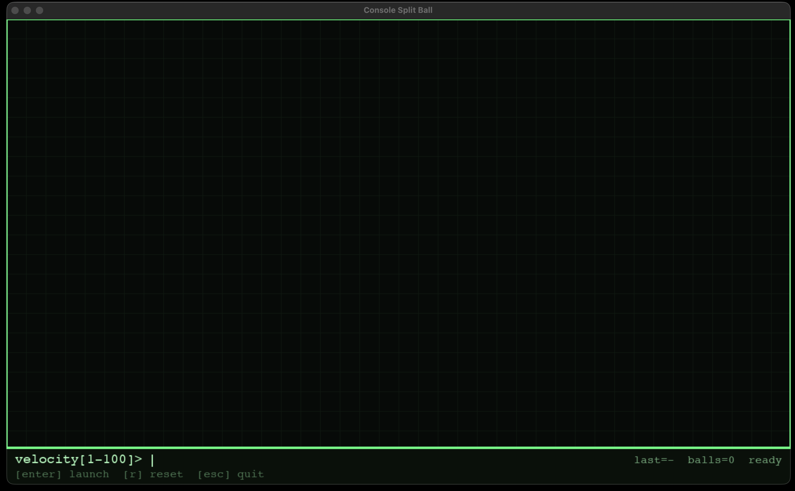
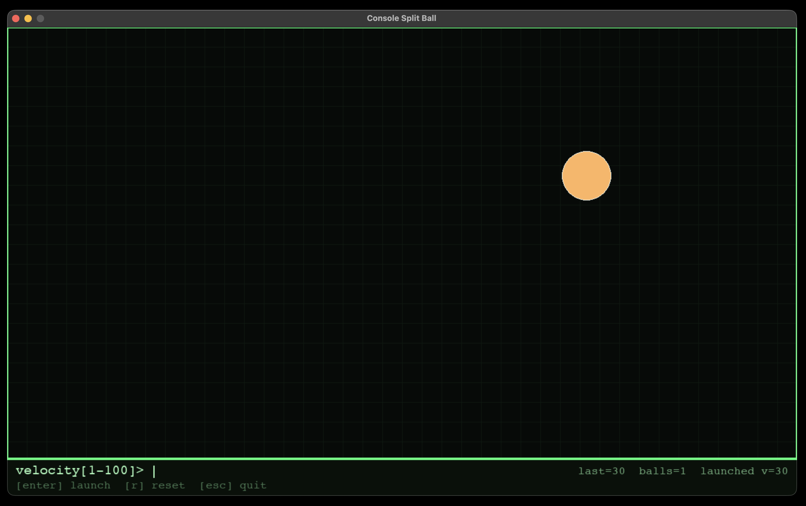
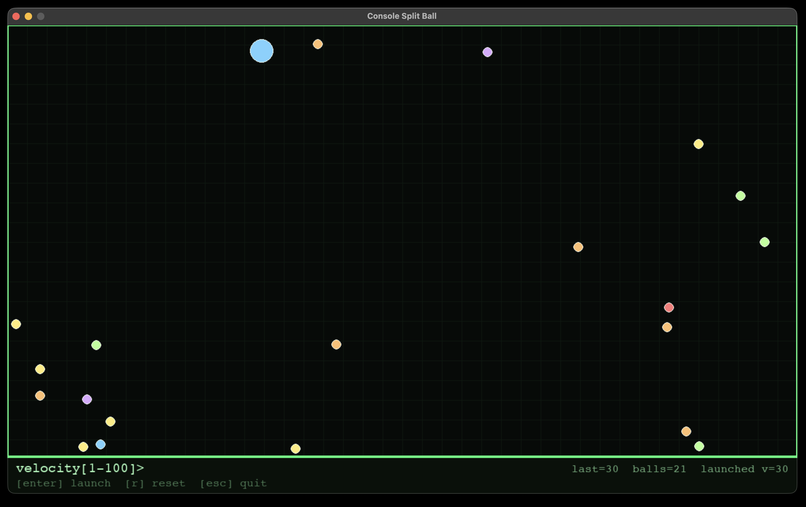

# Console Split Ball

## Overview
Console Split Ball is a Python-based physics simulation built with Pygame.  
The project demonstrates how simple physics principles can be implemented in an interactive environment to create a visually engaging simulation.

The goal of the project is to showcase:

- Practical implementation of physics concepts such as gravity, friction, collision response, and energy dispersion
- Real-time graphical rendering using Python and Pygame
- Event-driven programming and simulation loops
- User interaction through a minimal console-style interface

The program launches a ball from the right side of the screen using a velocity specified by the user. When the ball hits a boundary, it fragments into smaller balls. The number of fragments and their behaviour depend on the initial velocity and collision energy.

The simulation incorporates:
- Gravity
- Air friction
- Boundary collisions
- Inter-ball collision physics
- Energy-based fragmentation mechanics

This project is intended as both a physics demonstration and a showcase of programming and simulation design skills.

---

## Features

- Console-inspired interface layout
- Real-time physics simulation
- Velocity-based fragmentation system
- Ball-to-ball collision physics
- Gravity and friction modelling
- Interactive input system
- Open source under the MIT License

---

## Requirements

Python 3.9 or newer

Python library:
- pygame

---

## Installation

Clone the repository:

```
git clone  https://github.com/hemangsharma/Console-Split-Ball.git
cd console-split-ball
```

Install dependencies:

```
pip install pygame
```

---

## Running the Simulation

Run the Python script:

```
python split_ball_game.py
```

A window will open showing the simulation environment.

The bottom console area allows you to input velocity values.

---

## Controls

| Key | Action |
|----|------|
| Enter | Launch ball using entered velocity |
| R | Reset simulation |
| ESC | Exit program |
| Backspace | Edit velocity input |

Velocity range:

```
1 - 100
```

Higher velocities produce more energetic collisions and greater fragmentation.

---

## How the Simulation Works

1. The user enters a velocity value.
2. A ball is launched from the right side of the window.
3. Gravity continuously accelerates the ball downward.
4. Friction slowly reduces velocity over time.
5. When the ball hits a boundary, energy is calculated.
6. If the collision energy exceeds a threshold, the ball fragments.
7. Fragments inherit momentum and interact with each other through collision physics.

The simulation uses simple Newtonian approximations rather than a full physics engine, making it lightweight and easy to understand.

---

## Purpose of the Project

This project was created to demonstrate:

- Interactive simulation design
- Game loop architecture
- Collision detection and resolution
- Physics-inspired system modelling
- Clean UI/UX design with minimal interface elements

It serves as both an educational tool and a portfolio project demonstrating practical programming and problem-solving skills.

---

## Screenshots






---

## License

This project is open source and distributed under the MIT License.
See the LICENSE file for details.

---

## Contributing

Contributions, improvements, and suggestions are welcome.

If you would like to extend the simulation with additional physics features, visual effects, or UI improvements, feel free to submit a pull request.